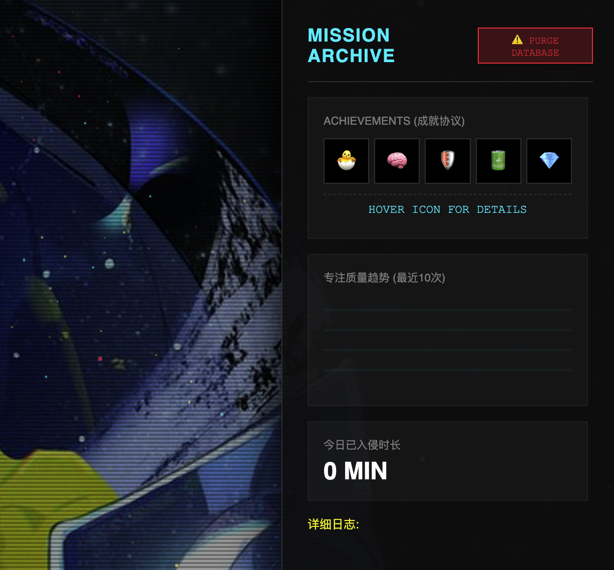
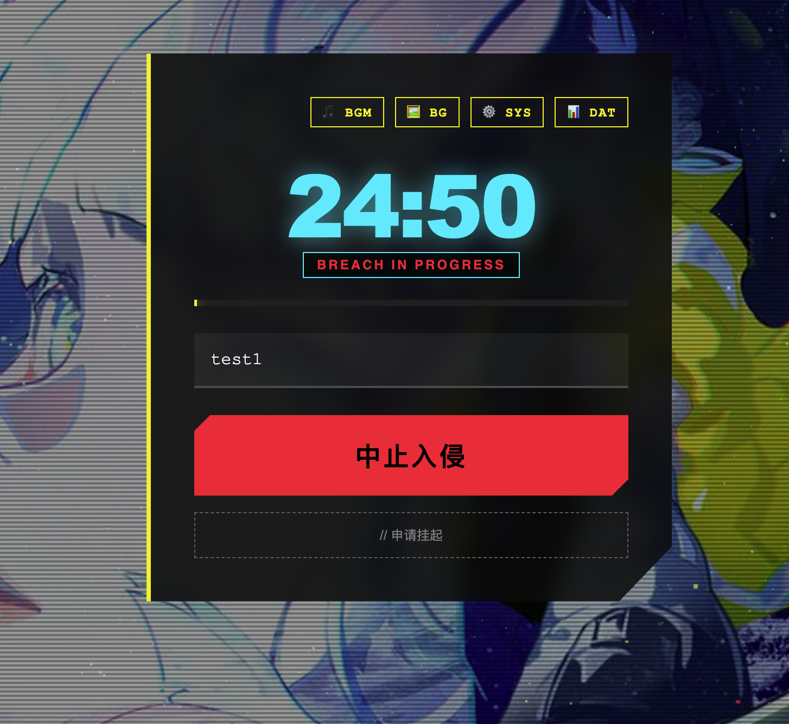

# cyber_clk
## a free cyber pomodoro timer to help u focus with reward mechanism

> "Wake the f**k up, Samurai. We have a task to burn."

     

### 说明
觉得市面上的番茄钟太无聊，所以我搓了这个***赛博朋克风专注时钟***

界面致敬《赛博朋克 2077》，带防摸鱼机制，而且用了 Web Worker 多线程，就算你切到后台去工作，倒计时也不会卡顿

快速使用：点击https://zljny11.github.io/cyber_clk/ （推荐chrome打开）

侧边栏版本：clone CyberSidePanel都本地，加入google的extension即可

- ***硬核防摸鱼***

暂停门槛：想暂停？得先写个 10 个字以上的理由，哪怕是借口也得编像样点!!!

自毁倒计时：暂停超过 10分钟 没回来？任务直接判定失败（神经连接中断）!

成就系统：根据专注时长解锁徽章，比如“初出茅厕”、“赛博思想家”等!

隐私安全：所有数据（日志、设置、成就）都只存在你自己的浏览器里（localStorage），无需联网，我也看不到!!!!!

自定义：觉得默认背景不帅？支持上传你自己的壁纸和 BGM!!

####  怎么用
开始入侵：输入你要干啥，点 "开始入侵"!

干活：网页标题会实时显示剩余时间（比如 24:59 | ACTIVE），不用切回来也能看!

结算：完事后给这次专注度打分（1-5星），生成趋势图

看数据：点 DAT 面板看日志和成就

删库跑路：如果想重置所有数据，点 PURGE 按钮清空

####  部署

这只是个静态网页。把 index.html 和背景图片直接拖到 Vercel 或者 GitHub Pages 上就能生成链接发给朋友用了。不需要懂代码。

---

### 📸 Screenshots / 界面预览

*(You can replace these links with your actual screenshots)*

| Main Interface | Data Panel | Pause Protocol |
| :---: | :---: | :---: |
|  |  |  |

---

## 觉得做的太乱了太垃圾了欢迎来喷！！！我但凡学习效率高点也不会沦落到自娱自乐写这玩意

## 📜 License

Project is open source under the [MIT License](LICENSE).

> **"Good luck in Night City."**

